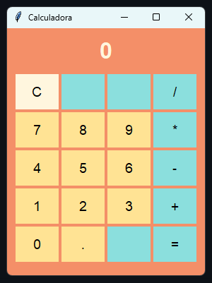

# Calculadora Digital com Tkinter


Este projeto é uma calculadora digital simples, desenvolvida em Python utilizando a biblioteca Tkinter para a interface gráfica. Permite realizar operações matemáticas básicas de forma prática, com uma interface intuitiva e responsiva.

## Demonstração



> **Nota:** Imagem ilustrativa. Para ver a calculadora em funcionamento, execute o script conforme instruções abaixo.

---

## Índice
- [Funcionalidades](#funcionalidades)
- [Pré-requisitos](#pré-requisitos)
- [Instalação e Execução](#instalação-e-execução)
- [Como funciona](#como-funciona)
- [Personalização](#personalização)
- [Estrutura do Projeto](#estrutura-do-projeto)
- [Licença](#licença)
- [Contato](#contato)

---

## Funcionalidades
- Realiza operações de soma, subtração, multiplicação e divisão
- Interface gráfica amigável e responsiva
- Botões para números e operações matemáticas
- Exibição do resultado em tempo real
- Botão para limpar a tela e reiniciar o cálculo

## Pré-requisitos
- Python 3.7 ou superior
  - [Download Python](https://www.python.org/downloads/)
- Tkinter (já incluso na maioria das instalações do Python)

## Instalação e Execução
1. **Clone ou baixe este repositório:**
   - Via terminal:
     ```bash
     git clone <url-do-repositorio>
     ```
   - Ou baixe o arquivo ZIP e extraia.
2. **Acesse a pasta do projeto:**
   ```bash
   cd tkinter_calc/calculadora
   ```
3. **Execute o script:**
   ```bash
   python calc.py
   ```

---

## Como funciona
O script utiliza a biblioteca Tkinter para criar a interface gráfica e gerenciar os eventos dos botões. Cada botão representa um número ou operação, e ao ser pressionado, atualiza o visor da calculadora. O cálculo é realizado ao pressionar o botão de igual (=), e o resultado é exibido imediatamente.

Exemplo simplificado de funcionamento:

```python
import tkinter as tk

def adicionar_numero(num):
    visor.insert(tk.END, num)

def calcular():
    try:
        resultado = eval(visor.get())
        visor.delete(0, tk.END)
        visor.insert(tk.END, str(resultado))
    except Exception:
        visor.delete(0, tk.END)
        visor.insert(tk.END, "Erro")

app = tk.Tk()
visor = tk.Entry(app)
visor.pack()
# ...criação dos botões...
app.mainloop()
```

---

## Personalização
Você pode personalizar facilmente a aparência e o funcionamento da calculadora:

- **Cores dos botões e fundo:** Modifique os parâmetros `bg` e `fg` dos widgets.
- **Fonte:** Altere o parâmetro `font` dos botões e do visor.
- **Operações:** Adicione mais operações matemáticas conforme necessário.

Exemplo para mudar a cor de fundo:
```python
app.configure(bg="#f0f0f0")
```

---

## Estrutura do Projeto
- `calc.py`: Código-fonte principal da calculadora
- `LICENSE`: Licença do projeto
- `README.md`: Este arquivo de documentação

---

## Licença
Este projeto está licenciado sob os termos do arquivo [LICENSE](LICENSE).

---

## Contato
Dúvidas, sugestões ou melhorias? Sinta-se à vontade para abrir uma issue ou contribuir!